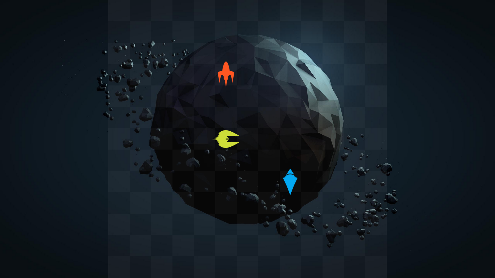
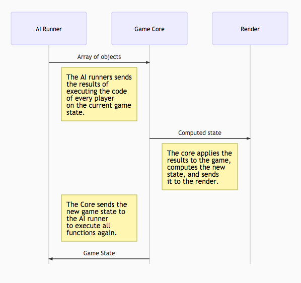
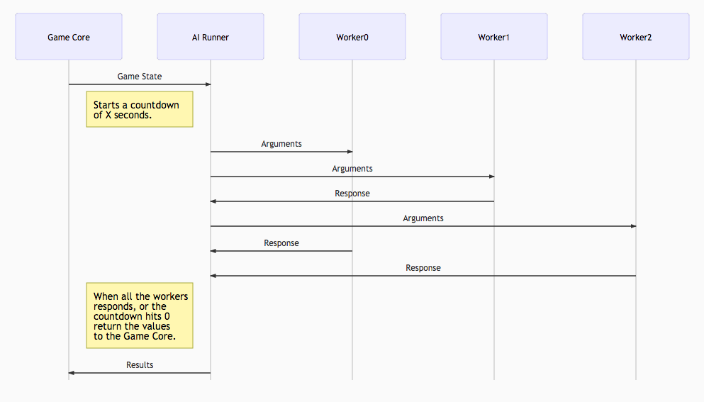

# ClashJS

This is an experiment. The idea is to create a battle game, where the participants code their AI, and then we make them fight!

The repo doesn't contain any code yet, just work-in-progress specs.

# Game. Functional(?) Spec.

## Introduction.
Games and coding are fun! I want to make a game where we can confront AI vs AI.

The game is simple: we will put all the players in a battle arena, and then make them fight to death. We will put a coin in the arena, and the players should try to collect it. The last player alive wins!

### Game Rules.
* Every player will have a position and direction on the grid. A player can not go over the grid limits, and can only face north, west, south or east.
* The game will be turn based. Every turn we will excecute the AI of every player passing as arguments:
  * The current position and direction of the player.
  * The position of all other players.
  * The position of the ammo.
  * A environment configuration option with:
    * Grid size.
* Every turn a player must execute some of the following actions:
  * Move one step in its current direction.
  * Turn into any of the four directions.
  * Shoot.
* A player can shoot to try to destroy another player. The shoots have the following characteristics:
  * A shoot have a range of 3 squares.
* A player can collect ammo in the moment it steps over it. A new coin may appear in any moment of the game.
* If nobody dies or collects a coin in 50 turns, the game will be considered a tie with all the survivors.

# Game Technical Spec.

## Problem.
We should make an app that can take functions provided by the users, execute them, and render the game as specified in the functional spec.

## Constraints.
* Just. The game mechanics should avoid to accidentally benefit players by its random nature. The order of execution of the AIs should not benefit any player. The position of the newly create coins should try to be as just for everyone.
* Be safe. A player code should not be able to modify anything other than itself.
* Be resilient as possible. If a player crashes or stop responding, the show must go on.

## Hypothesis.

### Player Definition.
Let the *player definition* (`playerDefinition`) be an object with the player info and its AI function.

    {
      info: {
        name: 'javierbyte'
      },
      ai: function(playerState, enemiesPosition, gameEnvironment) {
        // think...
        return 'move';
      }
    }

### Player State.
Let the *player state* (`playerState`) be an object with a player information like the following:

    {
      position: `[<number>, <number>]`,
      direction: `<number>`, // 0: north, 1: east, 2: south, 3: west
      ammo: `<number>`
    }

### Game Environment.
Let the *game environment* (`gameEnvironment`) be a configuration object like the following:

    {
      gridSize: [<number>, <number>],
      ammoPosition: <array of [<number>, <number>] arrays>
    }

### Game State.
Let the *game state* (`gameState`) be an object with the array of all user states, and the game environment.

    {
      playerStates: <array of `playerStates`>,
      gameEnvironment: <`gameEnvironment`>
    }

### Architecture.

We can divide the problem in 3 big steps.

* **AI Runner**. This will take all the user provided functions and the current game state, and execute every function.
  * This will take care of catch errors on the functions, and stop non-responding functions to hang the window.
* **Game Core**. This will take the responses that the AI Runners sends, and apply the game logic on them.
  * Kill killed players.
  * Move and turn players.
  * Collect and count coins.
  * Generate new coins if necessary.
  * Set the paralized turns to players that shooted.
  * Count if too many inactive turns had passed.
  * Stop the game when it ends.
* **Render**. This will take the game state and render it nicely.

They will interact as follows:

<!---
sequenceDiagram
AI Runner->> Game Core: Array of objects
Note left of Game Core: The AI runners sends   the results of  executing the code   of every player on the current game state.
Game Core->> Render: Game state
Note left of Render: The core applies the results to the game, computes the new state, and sends it to the render.
Note left of Game Core: The Core sends the new game state to the AI runner to execute all functions again.
Game Core->>AI Runner: Game State

http://knsv.github.io/mermaid/live_editor/
-->

# AI Runner. Spec.

## Problem.
The AI runner should execute all the functions that the players provided, with the current user state, all user states, and game enrivonment as arguments.

## Constraints.
* Prevent the user functions to modify anything except itself.
* Catch executions errors, and simply return `null` as response to the Game Core.
* Detect if any functions gets stuck in an infinite loop, and return `null` as response.

## Hypothesis.
We can run the functions as WebWorkers because:
* They can not access the dom and modify things.
* Runs in a sandbox. If they crash or stop responding we can detect it.
* Bonus: We can parallelise the excecution.

The game is designed to make irrelevant the order of execution of the AIs. So we are safe running all this asynchronous.

## Solution.
To prevent the functions to take so much time thinking (probably because an infinite loop), we will create an array of `null`s, where we will put the responses of the workers as they arrive. If `X` seconds passes (enough time to think for almost everything, except infinite loops, of couse) then we will pass the `null`ified response of that worker, and the Game Core will kill that player.

<!---
sequenceDiagram
Game Core->> AI Runner: Game State
Note left of AI Runner: Starts a countdown of X seconds.
AI Runner->> Worker0: Arguments
AI Runner->> Worker1: Arguments
Worker1->> AI Runner: Response
AI Runner->> Worker2: Arguments
Worker0->> AI Runner: Response
Worker2->> AI Runner: Response
Note left of AI Runner: When all the workers responds, or the countdown hits 0 return the values to the Game Core.
AI Runner->> Game Core: Results

http://knsv.github.io/mermaid/live_editor/
-->

# PlayerClass.

This javascript class will recive a `playerDefinition` and return a player instance.

## Arguments:
  * [`playerDefinition`](#player-definition).

## Methods:
  * `getInfo`. Will return the player info.
  * `execute`. Will receive the following arguments:
    * [`playerState`](#player-state). The current player state.
    * `enemiesPosition`. An array of the other players positions. Example: `[[2,3], [5, 6]]`.
    * [`gameEnvironment`](#game-environment). The game environment object.

# CashJS Core.

This is a javascript class that will receive the initial world environment, the player functions, and will calculate the game state.

## Arguments:
  * `playerDefinitionArray`. An array of [`playerDefinition`](#player-definition) objects.

## Methods:
  * `getState`. Will return the current [`gameState`](#game-state).
  * `nextStep`. Will execute a step for every player (all individual plys).
